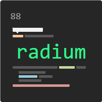
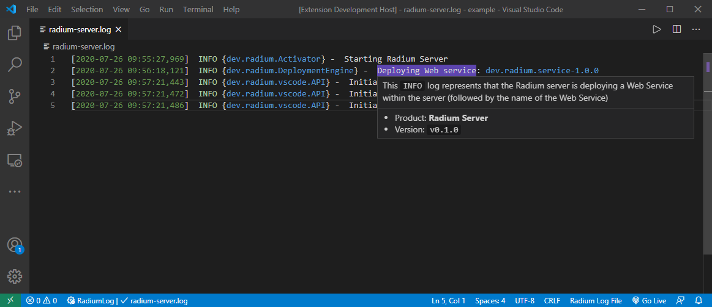

<h1 align='center'>Radium</h1>

<p align='center'>A <code>log</code> highlighter extension for VS Code</p>

<br />
<br />

<p align='center'>
    
</p>

<br />
<br />

A Visual Studio Code extension to highlight log files. The out-of-the-box colors are customizable but by default the currently applied theme's color schemes are used to highlight the logs.

:construction: Under development

## Demo

- `radium-server.log`

    ```log
    [2020-07-26 09:55:27,969]  INFO {dev.radium.Activator} -  Starting Radium Server
    [2020-07-26 09:56:18,121]  INFO {dev.radium.DeploymentEngine} -  Deploying Web service: dev.radium.service-1.0.0
    [2020-07-26 09:57:21,443]  INFO {dev.radium.vscode.API} -  Initializing API: vscode-OverviewRulerColor
    [2020-07-26 09:57:21,472]  INFO {dev.radium.vscode.API} -  Initializing API: vscode-OverviewRulerLane
    [2020-07-26 09:57:21,486]  INFO {dev.radium.vscode.API} -  Initializing API: vscode-DecorationRenderOptions
    ```

- `settings.json`
  
    ```json | settings.json
    {
        "radium.highlight": [
            {
                "pattern": "(Deploying Web service)",
                "highlight": "#6f42c1",
                "tooltip": "This `INFO` log represents that the Radium server is deploying a Web Service within the server (followed by the name of the Web Service)\n\n---\n- Product: **Radium Server**\n- Version: `v0.1.0`"
            }
        ]
    }
    ```

- Radium / VS Code output

    

## Configuration model

```json
{
    "radium.highlight": [
        {
            "pattern": "a regex pattern to be highlighted or plain text" [required],
            "color": "the text/font color" [optional],
            "highlight": "a highlight/background color",
            "tooltip": "a tooltip/hover message to be shown" [optional]
        }
    ]
}
```

---

Inspired by [Log File Highlighter Extension](https://marketplace.visualstudio.com/items?itemName=emilast.LogFileHighlighter) & made with :heart:
